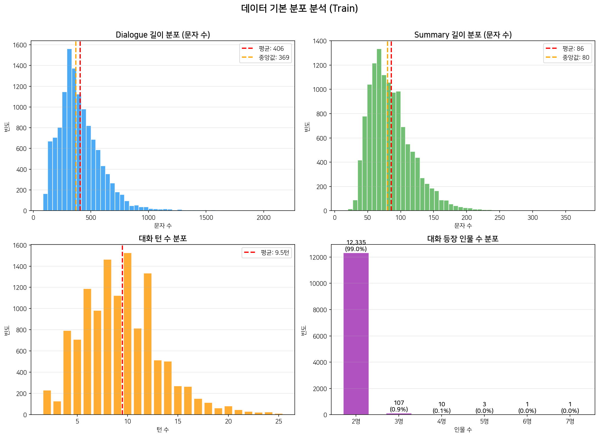
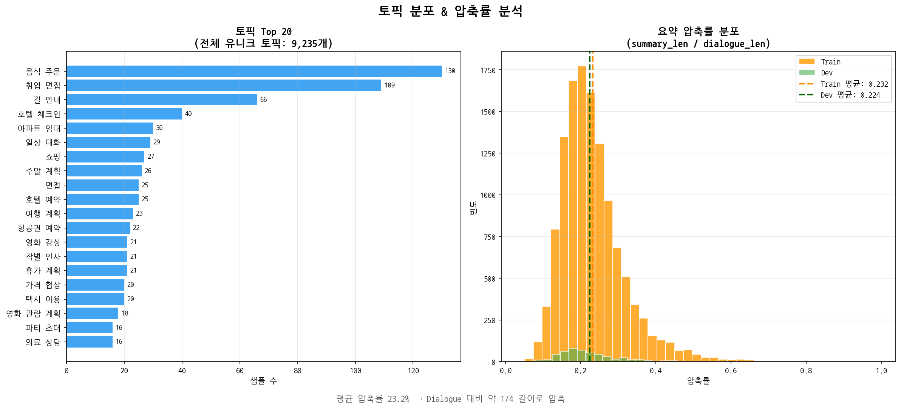
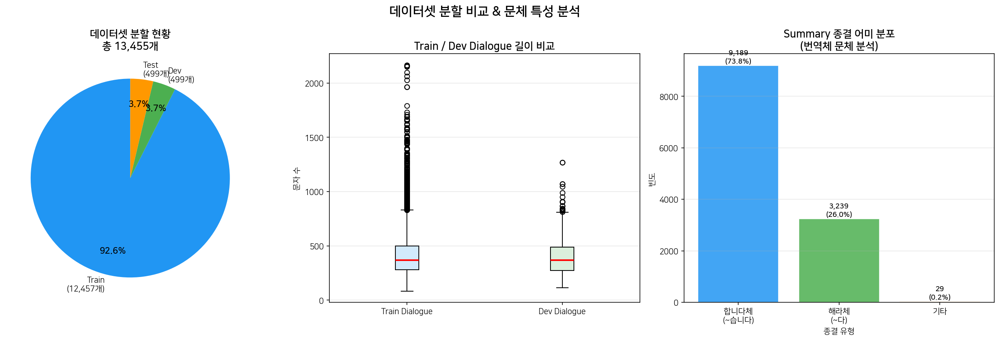
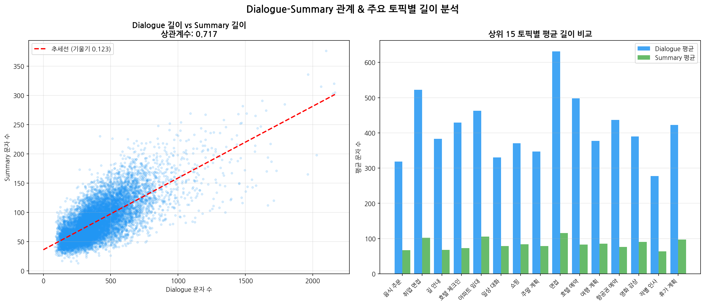

# 🧠 한국어 대화 요약 NLP 경진대회 실험 회고

> **KoBART에서 Qwen3-14B까지 — 솔로 참가자의 103회 실험 기록**

[]()
[]()
[]()
[]()

---

## 📌 대회 개요

| 항목 | 내용 |
|---|---|
| **Task** | 한국어 대화(dialogue) → 요약문(summary) 생성 |
| **평가 지표** | ROUGE-1 / ROUGE-2 / ROUGE-L 가중 평균 (Final Score) |
| **참가 형태** | 솔로 참가 |
| **기간** | 2026년 4월 23일 ~ 2026년 5월 8일 |
| **최종 Public** | **52.97점** (Qwen3-14B Competition FT ep3) |
| **최종 Private** | **50.01점** |

---

## 📂 데이터 구성

| 분할 | 샘플 수 | 컬럼 |
|---|---|---|
| Train | 12,457개 | fname, dialogue, summary, topic |
| Dev | 499개 | fname, dialogue, summary, topic |
| Test | 499개 | fname, dialogue |

### 핵심 데이터 특성

- `#Person1#`, `#Person2#` 태그 구조의 2인 대화 (전체의 99%)
- 영어 원본을 한국어로 번역한 **번역체 문체**
- Summary 평균 길이: **86자** (Dialogue 대비 약 23% 압축)
- 대화 턴 수 평균: **9.5턴**
- 유니크 토픽: **9,235개** (매우 다양한 도메인)

> ⚠️ **핵심 인사이트**: 자연스러운 한국어보다 **번역체 어투**로 생성해야 ROUGE 점수가 높음  
> 멘토 확인: *"학습 데이터의 어투로 생성해야 더 높은 점수를 받을 수 있다"*

---

## 📊 EDA 분석 결과

### 기본 분포


### 토픽 분포 & 압축률


### 번역체 문체 특성


### Dialogue-Summary 길이 관계


---

## 🔬 전체 실험 흐름

```
Phase 1       Phase 2          Phase 3       Phase 4      Phase 5       Phase 6
KoBART    →  Reranking    →  Postprocess →  모델 교체  →  LLM 도입  →  Comp FT
baseline     실험              튜닝           PKO-T5        Qwen3-14B     + 최적화
47.47점      27~38점 ↓        41.41점        48~49점       51.74점       52.97점 ★
```

---

## 📈 전체 실험 기록

| # | 실험명 | 핵심 변경사항 | Public Score | 결과 |
|---|---|---|---|---|
| 1 | PKO-T5 baseline | KoBART → PKO-T5 전환 | 48.43 | - |
| 2 | PKO+AIHub+SAMSum | 외부데이터 혼합 FT | 49.64 | ↑ |
| 3 | pko_safe_epoch2 | epoch 조정 | 41.45 | ↓↓ |
| 4 | Qwen3 single | Qwen3-14B 도입 | 51.74 | ↑↑ |
| 5 | qwen_pko_longer | Qwen+PKO longer 앙상블 | 51.74 | → |
| 6 | mentor_mbr | 멘토 체크포인트 MBR | 48.73 | ↓ |
| 7 | qwen_mbr3 | 프롬프트 3개 MBR | 51.52 | ↓ |
| 8 | qwen_mentor_mbr3 | Qwen+mentor+mbr MBR | 50.01 | ↓ |
| 9 | **qwen3_comp_ft_ep3** ⭐ | **train.csv 파인튜닝 3epoch** | **52.97** | **↑↑ BEST** |
| 10 | ep3+v2+single MBR | same-family MBR | 52.44 | ↓ |
| 11 | continued_v2 | ep3 기반 추가 1epoch lr=5e-5 | 51.63 | ↓ |
| 12 | ep3_continued | ep3 기반 추가 1epoch lr=1e-5 | 51.88 | ↓ |
| 13 | few-shot | train 예시 5개 프롬프트 | 48.98 | ↓↓ |
| 14 | beam4 | num_beams=4 decoding | 51.93 | ↓ |
| 15 | SAMSum rare FT | rare-topic 622개 + train FT | 52.54 | ↓ |
| 16 | hybrid v1 | rare 186개 length routing | 50.01 | ↓↓ |
| 17 | hybrid v2 | rare 35개 conservative routing | 52.63 | ↑ |
| 18 | hybrid v3 | rare 96개 완화 routing | 52.26 | ↓ |
| 19 | hybrid v4 | rare 18개 manual pruning | 52.64 | ↑ |
| 20 | hybrid v5 | rare 26개 추가 | 52.61 | ↓ |
| 21 | **hybrid v4.1** ⭐ | **rare 10개 semantic gain만** | **52.78** | **↑↑** |

---

## 🏆 최종 제출

| 제출 | Public Score | 역할 |
|---|---|---|
| **qwen3_comp_ft_ep3** | **52.97** | Public sniper (최고점) |
| **hybrid v4.1** | **52.78** | Private hedge |

---

## ✅ 성공 전략 vs ❌ 실패 전략

### ✅ 성공한 전략

| 전략 | 이유 |
|---|---|
| KoBART checkpoint-2250 baseline 확립 | 재현 가능한 기준선 확보 |
| Qwen3-14B 도입 (멘토 제공) | LLM이 번역체 패턴을 자연스럽게 학습 |
| Competition train data FT (ep3) | 대회 데이터 distribution에 최적화 |
| micro selective routing (v4.1) | 10개 semantic gain 케이스만 rare로 교체 |

### ❌ 실패한 전략

| 전략 | 실패 원인 |
|---|---|
| Cosine Reranking | 의미 유사도 ≠ lexical ROUGE |
| Multi-candidate Sampling | #pers 등 노이즈 토큰 다수 발생 |
| Same-family MBR | ep3가 499개 중 499개 독식 → diversity 없음 |
| AIHub 외부데이터 혼합 | 문체 불일치로 ROUGE 하락 |
| Continued FT (lr=5e-5) | Catastrophic drift 발생 |
| Few-shot 프롬프트 | 설명체 스타일로 번역체 alignment 붕괴 |

---

## 💡 원래 계획 vs 실제 결과

| 원래 계획 | 실제 결과 | 이유 |
|---|---|---|
| PKO-large + Qwen MBR | 포기 | PKO 41~49점, quality gap 너무 큼 |
| 여러 모델 architecture MBR | 포기 | 시간 부족 + quality gap |
| AIHub 외부데이터 활용 | 실패 | 문체 불일치로 ROUGE 하락 |
| 하이퍼파라미터 튜닝 | 미실시 | 시간 부족 |
| SAMSum full FT | 마감 초과 | 학습 2시간+ 소요 (완료 후 제출 불가) |

---

## 🔍 가설 검증 결과

| 가설 | 결과 | 비고 |
|---|---|---|
| 외부데이터 추가 → 성능 향상 | ❌ 실패 | 문체 불일치가 원인 |
| Qwen이 PKO보다 강하다 | ✅ 확인 | 51.74 vs 49.64 |
| fine-tuning → 성능 향상 | ✅ 확인 | ep3 52.97 |
| same-family MBR → 효과 있다 | ❌ 실패 | ep3 499개 독식 |
| beam/decoding tweak → 효과 | ❌ 실패 | FT 효과 >> decoding |
| continued FT → 추가 상승 | ❌ 실패 | 오히려 하락 |
| rare-topic robustness hedge | △ 부분 성공 | Public 52.54↓ / Private 50.10↑ |
| micro selective routing | ✅ 확인 | v4.1 52.78 |
| minimum effective injection | ✅ 확인 | 10개 sweet spot |
| human-guided pruning > heuristic | ✅ 확인 | v4 < v4.1 |

---

## 📚 논문 근거 (가설 검증)

실험 중 느낀 가설들을 논문으로 검증했습니다.

### Style Mismatch → ROUGE 하락

> *"summary wording would be completely different and penalized by similarity metrics"*  
> — [Can One Size Fit All? Multi-Domain Summarization Failure Analysis (2025)](https://arxiv.org/html/2503.15768v2)

→ few-shot 설명체 하락, AIHub drift, beam4 하락의 원인 설명

### Same-family MBR의 한계 (Diversity 부족)

> *"effectiveness of increasing diversity to enhance MBR decoding performance"*  
> — [Generating Diverse and High-Quality Texts by MBR Decoding (ACL 2024)](https://aclanthology.org/2024.findings-acl.503.pdf)

→ ep3 + continued + beam4 같은 계열 MBR 실패 원인 설명

### Dialogue Variation에 모델이 민감

> Unseen perturbation/OOD에서 summarization 모델 성능 하락  
> — [Evaluating Robustness of Dialogue Summarization Models (2023)](https://arxiv.org/abs/2311.08705)

→ rare-topic hedge 전략의 근거

### SAMSum이 대회 스타일에 가까운 이유

> SAMSum은 messenger-like dialogue + concise third-person summary 특화  
> — [SAMSum Corpus Paper (2019)](https://arxiv.org/abs/1911.12237)


---

## 💬 멘토 피드백 요약

| 질문 | 핵심 답변 |
|---|---|
| Inference 설정만으로 ROUGE 변동이 정상인가? | KoBART 같은 소형 모델은 decoding 전략에 극도로 민감. 정상 현상. |
| 자연스러운 요약인데 ROUGE가 낮은 이유? | 데이터가 번역체. 번역 어투 alignment가 점수에 직결. |
| Multi-candidate rerank vs Single beam? | Beam search 단독이 더 안정적. Reranker가 번역체 데이터에 미최적화. |
| 50점 이상을 위한 전략은? | 모델 선정 → 데이터 증강 → 앙상블 순서. Inference 튜닝만으론 한계. |
| 후처리를 강화해야 하나? | 최소화 권장. 모델 앙상블이 더 안전. |

---

## 📊 Public vs Private 분석

| 모델 | Public | Private | 하락폭 |
|---|---|---|---|
| qwen3_comp_ft_ep3 | 52.97 | 50.01 | -2.95 |
| EP3 Rare Hybrid v4.1 | 52.78 | 49.96 | -2.82 |
| RareTopicFT 단독 | 52.54 | **50.10** | -2.44 |
| KoBART baseline | 47.47 | 44.63 | -2.84 |

> 💡 **핵심 발견**: rare-topic FT는 Public에서 하락했지만 Private에서는 가장 높은 점수를 기록.  
> Public leaderboard 최적화 ≠ Private robustness 라는 tradeoff를 직접 확인.

---

## 🎯 핵심 인사이트

1. **모델 크기가 전략보다 중요하다**  
   KoBART(소형) → Qwen3-14B(대형)으로의 전환이 가장 큰 성능 도약 제공

2. **번역체 데이터 특성 파악이 먼저다**  
   EDA 없이 튜닝부터 했다면 방향 자체가 틀렸을 것

3. **복잡한 전략 < 단순한 Fine-tuning**  
   80회 실험 중 가장 강한 건 rerank/ensemble이 아닌 Competition FT 단독

4. **Public 최적화 ≠ Private Robustness**  
   이번 대회에서 이 tradeoff를 직접 경험하고 논문으로 검증

5. **가설은 논문으로 검증 가능했다**  
   style mismatch, MBR diversity, robustness — 모두 실제 연구와 연결

---

## 📁 디렉토리 구조

```
nlp-competition-retrospective/
├── README.md
├── eda/
│   ├── eda_01_basic_distribution.png
│   ├── eda_02_topic_compression.png
│   ├── eda_03_split_style.png
│   └── eda_05_length_analysis.png
└── presentation/
    └── nlp_retrospective.pptx
```

---


---

*KoBART 47.47점에서 시작해 Qwen3 52.97점까지 — 솔로 참가 · 103회 실험 · 논문으로 가설 검증*
